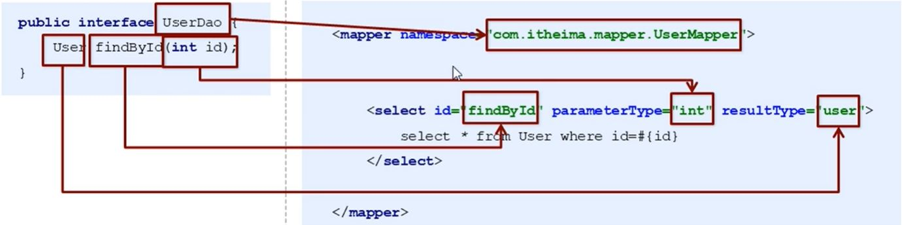

## Mybatis
 
### Mybatis的Dao层实现
  
* 代理开发方式(拒绝手动实现Dao层)
  1. Mapper接口开发需要遵循一下规范
     + Mapper.xml文件中的namespace与mapper接口的全限定名一致
     + Mapper接口方法名和Mapper.xml中定义的每个statement的id相同
     + Mapper接口方法的输入参数类型和Mapper.xml中定义的每个sql的parameterType类型相同
     + Mapper接口方法的输出参数类型和Mapper.xml中定义的每个sql的resultType类型相同
    


* 动态SQL
  1. if
    
  2. foreach
    
* sql语句的抽取 
    ```xml
    <!--抽取sql语句-->
        <sql id="selectUser">
            select * from user
        </sql>
    ```
  
* Mybatis多表配置
  1. 一对一配置: 使用<resultMap> + <association>
  2. 一对多配置: 使用<resultMap> + <collection>
  3. 多对多配置: 使用<resultMap> + <collection>
    
* Mybatis的注解开发
  1. 常用注解
     + Insert 实现新增
     + Update 实现更新
     + Delete 实现删除
     + Select 实现查询
     + Result 实现结果集封装
     + Results 可以与@Result一起使用, 封装多个结果集
     + One 实现一对一结果集封装
     + Many 实现一对多结果集封装