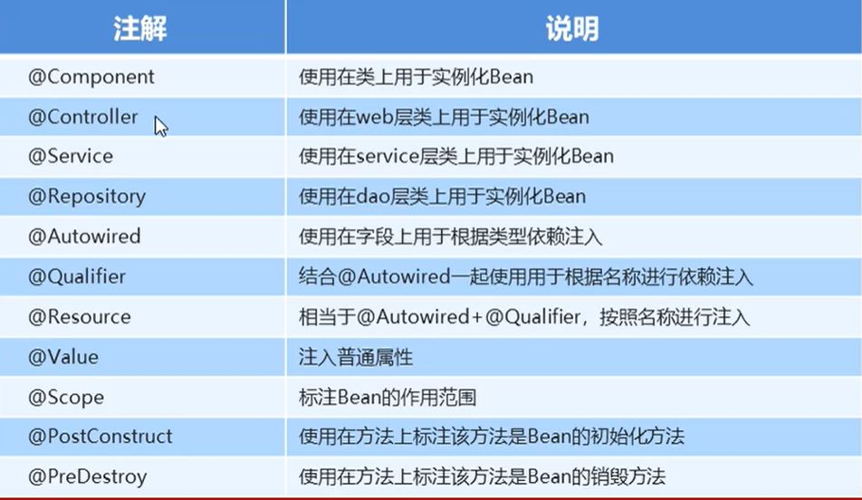
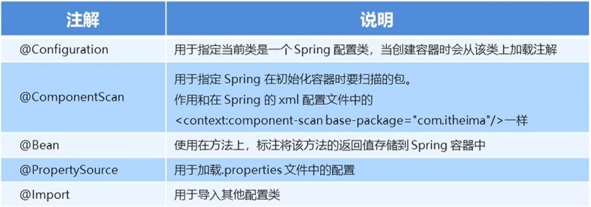
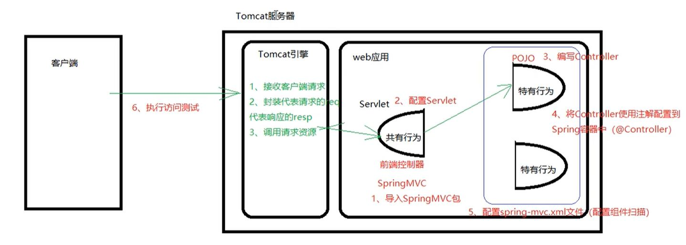
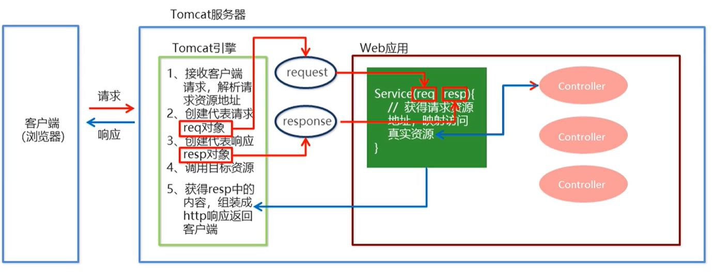
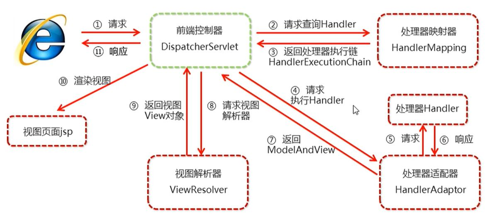
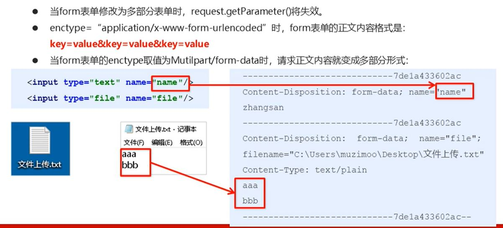
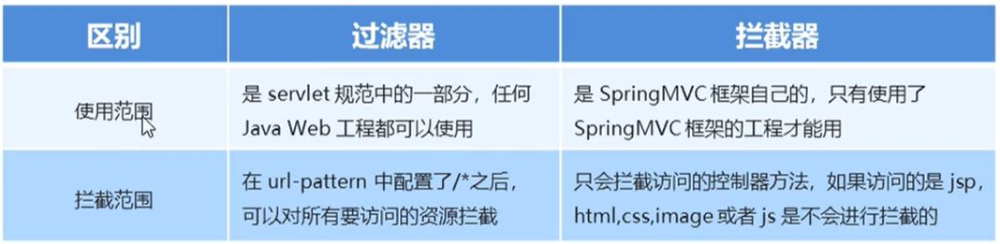

##Spring--IOC

###Spring配置文件
* Bean标签范围配置
  1. 当scope的取值为singleton时 (默认值)
     + Bean的实例化个数: 1
     + Bean的实例化时机: 当Spring核心文件(applicationContext.xml)被加载时, 实例化配置的Bean实例 
     + Bean的生命周期:
       1. 对象创建: 当应用加载, 创建容器时, 对象就被创建了
       2. 对象运行: 只要容器在, 对象一直活着
       3. 对象销毁: 当应用卸载, 容器被销毁时, 对象就被销毁了
    
  2. 当scope的取值为prototype时
     + Bean的实例化个数: 多个
     + Bean的实例化时机: 当调用getBean()方法实例化Bean时
       1. 对象创建: 当使用对象时, 创建新的对象实例
       2. 对象运行: 只要对象在使用中, 就一直活着
       3. 对象销毁: 当对象长时间不用时, 被Java的垃圾回收器回收了
    
* Bean声明周期配置
  1. init-method: 指定类中初始化方法
    
  2. destroy-method: 指定类中销毁方法
    
* Bean实例化的三种方式
  1. 无参构造方法实例化 (默认方式)
     + 有参构造
     ```xml
     <!--根据构造器参数的类型, 如果多个参数是同一类型就不建议使用-->
     <bean id="exampleBean" class="examples.ExampleBean">
        <constructor-arg type="int" value="7500000"/>
        <constructor-arg type="java.lang.String" value="42"/>
     </bean>
     
     <!--根据构造器参数的下标-->
     <bean id="exampleBean" class="examples.ExampleBean">
        <constructor-arg index="0" value="7500000"/>
        <constructor-arg index="1" value="42"/>
     </bean>
     
     <!--根据参数名称来设置-->
     <bean id="exampleBean" class="examples.ExampleBean">
        <constructor-arg name="name" value="zhangsan"/>
        <constructor-arg age="age" value="42"/>
     </bean>
     ``` 
  2. 工厂静态方法实例化
  3. 工厂实例方法实例化  
    
* Bean的依赖注入 
  1. 概念: 依赖注入是Spring框架核心IOC的具体实现, bean对象的创建依赖于容器, bean对象中的
           所有属性由容器来注入
  2. 方式:
     + set方法注入
     + 构造方法注入
     + 其他方法注入(p,c命名空间不能直接使用, 需要到入xml约束)
       - p命名空间 简化set方法注入
       - c命名空间 简化有参构造方法注入
    
  3. 注入数据的三种数据类型
     + 普通数据类型
       ```xml
          <bean id="userDao" class="com.fan.springstudy.UserDaoImpl">
              <property name="username" value="zhangsan"/>
          </bean>
       ```
     + 引用数据类型
     + 集合数据类型 
      ```xml
      <bean id="userDao" class="com.fan.springstudy.UserDaoImpl">
        <property name="stringList">
            <list>
                <value>aaa</value>
                <value>bbb</value>
                <value>ccc</value>
            </list>
        </property>

        <property name="userMap">
            <map>
                <entry key="k001" value-ref="user1"></entry>
                <entry key="k002" value-ref="user2"></entry>
            </map>
        </property>

        <property name="properties">
            <props>
                <prop key="p1">haha</prop>
                <prop key="p2">hehe</prop>
                <prop key="p3">xixi</prop>
            </props>
        </property>
     
        <!--数组类型-->
        <property name="books">
            <array>
                <value>西游记</value>
                <value>三国演义</value>
            </array>
        </property>
     
        <!--null-->
        <property name="email">
            <null/>
        </property>
      </bean>   
      ```

* 引入其他配置文件(分模块开发)
  1. 实际开发中, Spring的配置内容非常多, 导致繁杂体积很大, 所以, 可以将部分拆解到其他配置文件中,
     而在Spring主配置文件通过import标签进行加载
     ```xml
        <import resources="applicationContext-xxx.xml"/>
     ```

###Spring配置数据源

* 数据源(连接池)的作用 (常见数据源 DBCP C3P0 BoneCP Druid)
  1. 数据源(连接池)是为了提高程序性能而出现的
  2. 事先实例话数据源, 初始化部分连接资源
  3. 使用连接资源时从数据源中获取, 使用完毕后将连接资源归还给数据源  
    
* Spring配置数据源
  1. 引入context命名空间和约束路径
    ```xml
        <!--命名空间-->
        xmlns:context="http://www.springframework.org/schema/context"
        <!--约束路径 --> 
        http://www.springframework.org/schema/context
        http://www.springframework.org/schema/context/spring-context-3.0.xsd              
    ```

###Spring注解开发

* 注解
  1. 注意: 使用注解进行开发时, 需要在applicationContext.xml中配置组件扫描, 作用是指定哪个包及其子包下的Bean
     需要进行扫描以便识别使用注解配置的类, 字段, 和方法
     
       
     
  2. 一点小思考
     + @Resource(java自带的) 和 @Autowired(Spring自带)的比较
       1. 都是用来自动装配的, 都可以放在属性字段上
       2. @Autowired 根据type进行匹配, 要求这个对象已经存在
       3. @Resource 优先通过name进行匹配, 如果name找不到就通过type进行匹配, 两个都找不到就报错

###Spring集成Web环境

* ApplicationContext应用获取上下文:
  + 在Web项目中, 可以使用ServletContextListener监听Web应用的启动, 我们可以在web应用启动时就加载Spring的配置文件, 创建
    应用上下文对象ApplicationContext, 在将其存储到最大的域servletContext域中, 这样就可以在任意位置从域中获得应用上下文
    ApplicationContext对象了.
    
  + 上述分析不用手动实现, Spring提供了一个监听器ContextLoaderListener就是对上述功能的封装, 该监听器内部加载Spring配置文件,
    创建应用上下文对象, 并存储到ServletContext域中, 提供一个客户端工具WebApplicationContextUtils供使用者获得应用上下文对象.
    
  + 步骤:
    1. 在web.xml中配置ContextLoaderListener监听器(需要先导入spring-web坐标)
    2. 使用WebApplicationContextUtils供使用者获得应用上下文ApplicationContext对象
    
###SpringMVC

* 快速入门--开发步骤
  
  
* SpringMVC流程图
  
  
  
* SpringMVC的数据响应
  1. 页面跳转
     + 直接返回字符串
       
       `这种方式会将返回的字符串与视图解析器的前后缀拼接再跳转`
        ```xml
           <!--  配置内部资源视图解析器  -->
            <bean id="viewResolver" class="org.springframework.web.servlet.view.InternalResourceViewResolver">
                <property name="prefix" value="/jsp/"></property>
                <property name="suffix" value=".jsp"></property>
            </bean> 
           <!-- 
                转发: forward:/jsp/success.jsp
                重定向: redirect:/index.jsp
           -->
       ```
       
     + 通过ModelAndView对象返回
    
       
    
  2. 回写数据
     + 直接返回字符串
       
       `将需要回写的字符串直接返回, 但此时需要通过@ResponseBody注解告知SpringMVC框架, 方法返回的字符串不是跳转而是
        直接在http响应中返回`         

     + 返回对象或集合
    
       ```xml
          <!--在spring-mvc.xml中配置处理器映射器  -->
          <bean class="org.springframework.web.servlet.mvc.method.annotation.RequestMappingHandlerAdapter">
            <property name="messageConverters">
                <list>
                    <bean class="org.springframework.http.converter.json.MappingJackson2HttpMessageConverter"/>
                </list>
            </property>
          </bean>  
       ```
       `上述配置较为繁琐, 我们可以使用mvc的注解驱动代替上述配置 <mvc:annotation-driven/>`

* SpringMVC获得请求数据
  1. 获得基本类型参数
     + Controller中的业务方法的参数名称与请求参数的名称一直时, 参数会自动映射匹配
     + 当请求的参数名称与Controller的业务方法参数名称不一致时, 就需要通过@RequestParam注解显示绑定
       
        `value: 请求参数名称`
        
        `required: 指定是否必须包括请求参数, 默认是true, 提交时如果没有此参数会报错`
    
        `defaultValue: 当没有指定请求参数时, 则使用指定的默认值赋值`
    
  2. 获得POJO类型参数
     + Controller中的业务方法的POJO参数的属性名与请求参数的name一致, 参数会自动映射匹配
    
  3. 获得数组类型参数
     + Controller中的业务方法数组名称与请求参数的name一致, 参数会自动映射匹配
    
  4. 获得集合类型参数
     + 获取集合参数时, 要将集合参数包装到一个POJO中
     + 当客户端使用ajax提交时, 可以指定contentType为json形式, 那么在方法参数位置使用@RequestBody可以直接
       接收集合数据而无需使用POJO进行包装
       
  5. 获得Restful风格的参数
     + Restful风格的请求是使用 "url+请求方式"表示一次请求目的地, 常用的有GET(获取) POST(新建) PUT(更新) DELETE(删除)
     + 在业务方法中我们可以使用@PathVariable注解进行占位符的匹配获取工作   
    
  6. 自定义类型转换器
     + 定义转换器类实现Converter接口
     + 在配置文件中声明转换器
     + 在<annotation-driven>中引用转换器
    
  7. 获得Servlet相关API
     + SpringMVC支持使用原始ServletAPI对象作为控制方法的参数进行注入, 常用对象有:
       `HttpServletRequest` `HttpServletResponse` `HttpSession`
       
  8. 获得请求头
     + 使用@RequestHeader可以获得请求头信息, 相当于web阶段学习的request.getHeader(name)
       
        `value: 请求头的名称`
        
        `required: 是否必须携带此请求头`
     
     + 使用@CookieValue可以获得指定Cookie的值


        `value: 指定cookie的名称`
        
        `required: 是否必须携带此cookie`
 
  9. 文件上传
     + 文件上传客户端三要素
       1. 表单项type="file"
       2. post提交
       3. 表单的enctype属性是多部分表单形式, 即enctype="multipart/form-data"
     + 文件上传原理
    
     
     + 文件上传步骤
       1. 导入fileupload和io坐标
       2. 配置文件上传解析器
       3. 编写文件上传代码
  
---

 `Tips：关于请求数据乱码问题的解决办法`
 ```xml
   <!-- 配置全局过滤器, 解决中文乱码问题 -->
    <filter>
        <filter-name>CharacterEncodingFilter</filter-name>
        <filter-class>org.springframework.web.filter.CharacterEncodingFilter</filter-class>
        <init-param>
            <param-name>encoding</param-name>
            <param-value>UTF-8</param-value>
        </init-param>
    </filter>
    <filter-mapping>
        <filter-name>CharacterEncodingFilter</filter-name>
        <url-pattern>/*</url-pattern>
    </filter-mapping>
 ```

###JdbcTemplate

###SpringMVC拦截器(Interceptor)

* 简介
  1. 拦截器的作用: SpringMVC的拦截器类似于Servlet开发中的过滤器Filter, 用于对处理器进行预处理和后处理
    
  2. 拦截器和过滤器的区别
    
     
  3. 拦截器链
    + 执行顺序: 按照spring-mvc.xml里面的拦截器配置顺序

###SpringMVC异常处理机制

* 简单异常处理器
  ```xml
  <bean class="org.springframework.web.servlet.handler.SimpleMappingExceptionResolver">
        <property name="defaultErrorView" value="error"/>
        <property name="exceptionMappings">
            <map>
                <entry key="java.lang.ClassCastException" value="error1"/>
                <entry key="com.fan.exceptionStudy.exception.MyException" value="error2"/>
            </map>
        </property>
    </bean>
  ```
  
* 自定义异常处理器
  1. 创建自定义异常处理器实现HandlerExceptionResolver接口
  2. 配置异常处理器和异常页面


