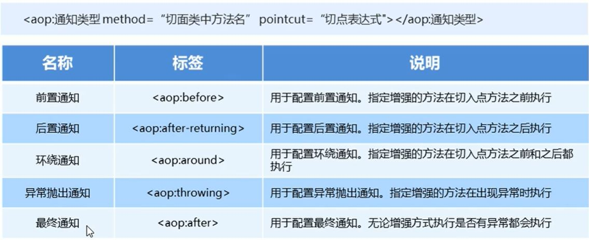

##Spring--AOP

###AOP简介
* 概述
  1. AOP(Aspect-Oriented Programming) 面向切面编程, 是通过预编译方式和运行期动态代理实现程序功能的
     统一维护的一种技术   
     
  2. 作用及其优势:
     + 在程序运行期间, 在不修改源码的情况下对方法进行功能增强
     + 减少重复代码, 提高开发效率, 并且便于维护
    
  3. 实现原理:
     + AOP的底层通过Spring提供的动态代理技术实现的, 在运行期间, Spring通过动态代理技术动态生成
       代理对象, 代理对象方法执行时进行增强功能的介入, 在去调用目标对象的方法, 从而完成功能的增强
       
  4. AOP动态代理技术
     + JDK代理: 基于接口的动态代理技术
     + cglib代理: 基于父类的动态代理技术
    
* 相关概念
  1. 目标对象: 代理目标对象
    
  2. 代理: 一个类被AOP织入增强后, 就产生一个结果代理类
    
  3. 连接点: 在Spring中, 指被拦截到的方法 (可以简单理解为可以被增强的方法就是连接点)
    
  4. 切入点: 是指我们要对哪些Joinpoint进行拦截定义 (可以简单理解为实际被增强的方法)
    
  5. Advice(通知/增强): 是指拦截到joinpoint之后要做的事
    
  6. Aspect(切面): 是指切点和通知的结合
    
  7.Weaving(织入): 是指把增强应用到目标对象来创建新的代理对象过程(可以理解为切点和通知的结合的过程)

* AOP底层使用哪种代理方式(jdk&cglib)
  + 在Spring中, 框架会根据目标类是否实现了接口来决定采用哪种动态代理的方式
    
* xml配置详解
```xml
<!--配置织入-->
    <aop:config>
        <!--声明切面-->
        <aop:aspect ref="myAspect">
            <!--切面 = 切点 + 通知-->
            <aop:before method="before" pointcut="execution(public void com.fan.aopStudy.aop.Target.save())"></aop:before>
        </aop:aspect>
    </aop:config>
```
  1. 切点表达式写法
     + 格式:`execution([修饰符] 返回值类型 包名.类名.方法名(参数))`
     + 访问修饰符可以不写
     + 返回值类型, 包名, 类名, 方法名, 可以使用 * 号代表任意
     + 包名于类名之间一个点代表当前包下的类, 两个点表示当前包及其子包下的类
     + 参数列表可以使用两个点表示任意个数, 任意类型的参数列表  
    
  2. 通知的类型
     
     
  3. 切点表达式的抽取

* 基于注解的AOP开发
  1. 注解通知的类型
    
     
  2. 切点表达式的抽取
    
  3. 注解aop开发步骤
     + 使用@Aspect标注切面类
     + 使用@通知注解标注通知方法
     + 在配置文件配置组件扫描和aop自动代理